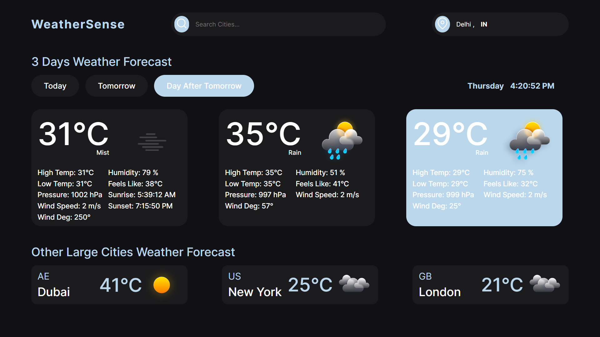
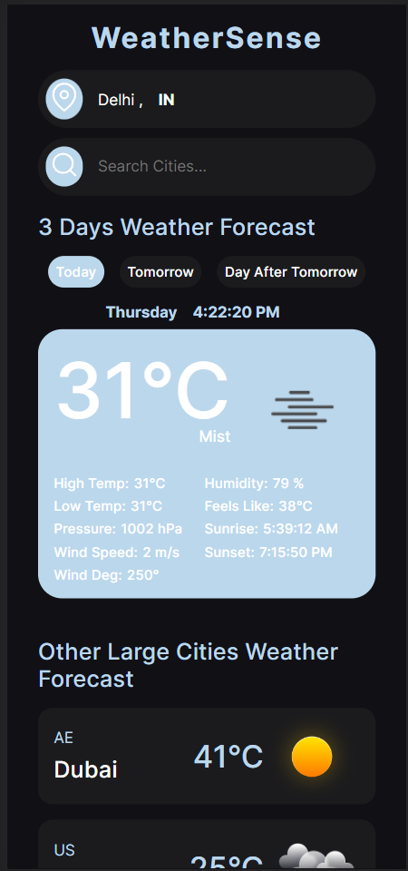

# Weather Sense - A Weather App fetch weather based on user current location  🌦️

## Table of contents

- [Overview](#overview)
  - [Screenshot](#screenshot)
  - [Features](#features-🌈)
  - [Links](#links)
- [My process](#my-process)
  - [Built with](#built-with)
  - [Useful resources](#useful-resources)
- [Author](#author)

## Overview

### Welcome to Weather Sense!

Weather Sense is not just another weather app. It's your personal weather companion that keeps you informed about the weather conditions in your current location. With a beautiful and intuitive interface, Weather Sense provides real-time weather updates, so you can plan your day accordingly.

### Features 🌈

📍 Location-based Weather Data: Weather Sense fetches the latest weather information based on your current location, ensuring you get accurate updates wherever you are.

☀️ Real-Time Updates: Stay ahead of the weather with real-time updates that keep you informed about temperature, humidity, wind speed, and more.

🌅 Daily Weather Forecast: Plan your day effectively by checking the weather forecast for the next 3 days.

🌧️ Hourly Forecast: Need to know if it's going to rain later? Weather Sense offers hourly forecasts, so you're always prepared for any sudden changes.

🌐 Worldwide Coverage: Whether you're at home or traveling to a new destination, Weather Sense covers weather data for cities around the globe.

### Screenshot

### Links

- Solution URL: [GitHub Solution Url](https://github.com/vashu-kashyap/Weather-Sense)
- Live Site URL: [Netlify Live Url](https://64c248920b1f2002a1267d2d--storied-chimera-da6f39.netlify.app/)

## My Process

### Built with

- Semantic HTML5 markup
- CSS custom properties
- [Scss](https://sass-lang.com/) - Css Preprocessor
- Flexbox
- CSS Grid
- Fetch Api
- JavaScript
- Mobile-first workflow

### Useful resources

- [openWeather Api](https://openweathermap.org/api) - This Api help for fetching data for weather and also help me for reverse geocoding. 

## Author

- Website - [im.vashukashyap](https://imvashukashyap.online/)
- Instagram - [@im.vashukashyap](https://www.instagram.com/im.vashukashyap/)
- Linkedin - [im-vashukashyap](https://www.linkedin.com/in/im-vashukashyap/)
